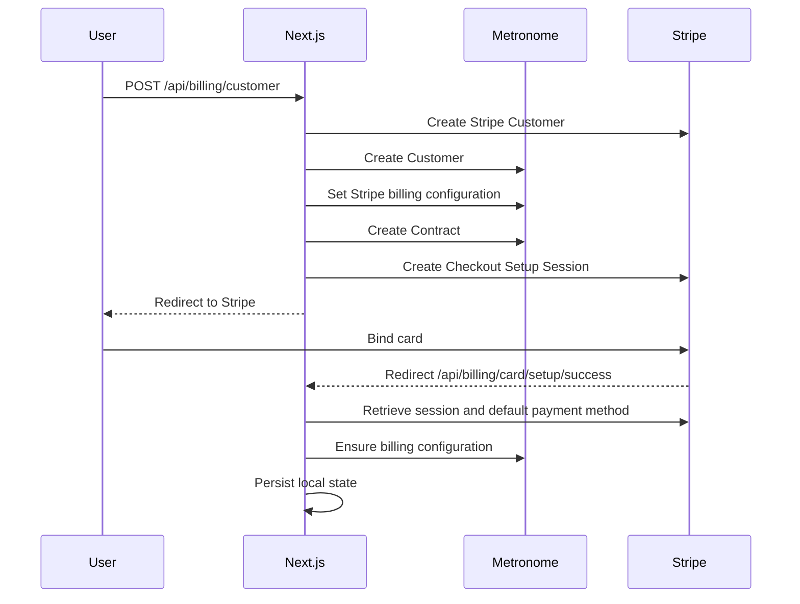
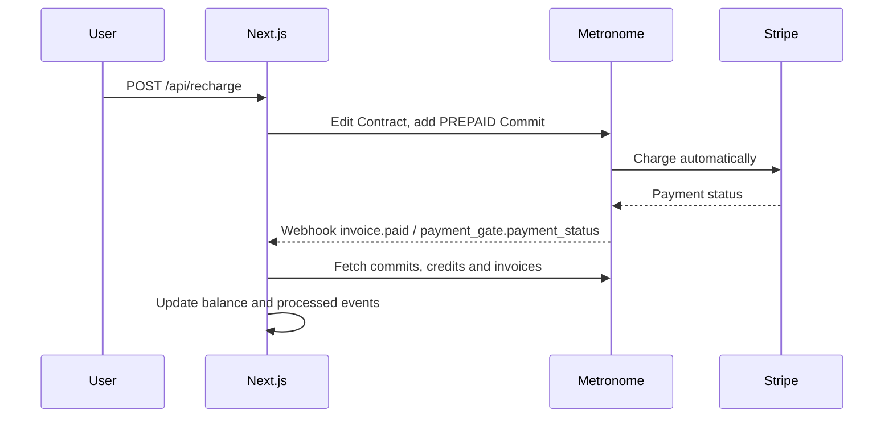
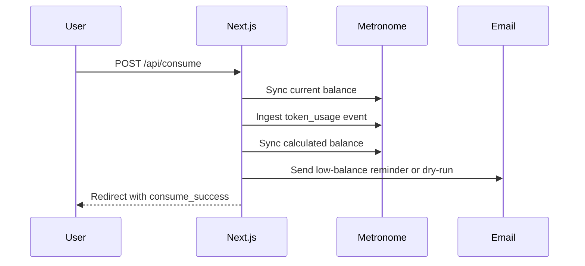

# Bill Service Next.js Demo

这是一个基于 Next.js App Router 的预付费账单服务 Demo，用来演示业务用户创建、绑卡、预付费充值、自动充值、Token 消耗上报、低余额提醒和 Metronome Webhook 回写。

Demo 使用 Metronome 管理 Customer、Contract、Prepaid Commit、Usage 与余额快照，使用 Stripe Setup Mode 绑定银行卡并由 Metronome 触发 Stripe 自动扣款。本地只保存演示状态，默认写入 `data/store.json`。

## 快速开始

```sh
npm install
cp .env.example .env
npm run dev
```

启动后访问 `http://localhost:3000`。

常用脚本：

- `npm run dev`：以开发模式启动，端口为 `3000`。
- `npm run build`：构建生产包。
- `npm run start`：启动生产服务，端口为 `3000`。

## 使用流程

1. 在 `.env` 中配置 Metronome、Stripe 和可选 SMTP 参数。
2. 打开首页，点击“创建 Customer 并绑卡”。
3. 服务端创建 Metronome Customer 和 Contract；如果配置了 Stripe，会创建 Stripe Customer 并跳转到 Stripe Setup Mode。
4. 用户在 Stripe 页面完成绑卡后回到 `/api/billing/card/setup/success`，服务端保存默认付款方式，并把 Stripe billing provider configuration 写入 Metronome。
5. 在首页输入充值金额并提交。服务端在 Metronome Contract 上新增 Prepaid Commit，由 Metronome 通过 Stripe 自动扣款。
6. Metronome Webhook 通知支付或余额变化后，服务端同步余额到本地状态。
7. 点击“上报 Token 消耗”模拟业务调用，服务端向 Metronome 上报 `token_usage` usage event，并再次同步余额。
8. 可配置自动充值阈值。当 Metronome 余额低于阈值时，Metronome 会按配置自动创建充值并走 Stripe 扣款。

## 配置文档

环境变量从 `new-bill/.env*` 读取。建议从 `.env.example` 复制出 `.env`，不要提交真实密钥。

基础配置：

- `DEFAULT_CONSUME_TOKENS`：首页“模拟业务消耗”的默认 Token 数，默认 `1`。
- `DEMO_USER_EMAIL`：Demo 用户邮箱，默认 `demo@example.com`。
- `BILL_SERVICE_DATA_DIR`：本地状态目录，默认 `./data`，状态文件为 `store.json`。

Metronome 配置：

- `METRONOME_BEARER_TOKEN`：调用 Metronome API 的 token。创建 Customer、Contract、充值、自动充值、余额同步和 diagnostics 都需要。
- `METRONOME_RATE_CARD_ID`：创建 Customer 后为其创建 Contract 使用的 rate card id。
- `METRONOME_COMMIT_PRODUCT_ID`：创建 Prepaid Commit 和自动充值阈值 Commit 使用的 product id。
- `METRONOME_CREDIT_TYPE_ID`：可选，写入 Prepaid Commit 的 access schedule 和 invoice schedule。
- `METRONOME_COMMIT_ACCESS_DAYS`：可选，充值创建的 Prepaid Commit 可用天数，默认 `365`。
- `METRONOME_COMMIT_PRIORITY`：可选，Prepaid Commit 优先级，默认 `100`。
- `METRONOME_COMMIT_CUSTOM_FIELDS_JSON`：可选，写入 Commit 的自定义字段，值必须是 JSON object。

Stripe 配置：

- `STRIPE_SECRET_KEY`：Stripe secret key。绑卡、创建 Stripe Customer、设置默认付款方式和自动扣款校验需要。

自动充值与低余额提醒：

- `MIN_AUTO_RECHARGE_TOP_UP_AMOUNT`：自动充值触发阈值与最低保留额度之间的最小差值，单位 USD，默认 `10`。
- `LOW_BALANCE_REMINDER_THRESHOLD`：低余额提醒阈值，单位 USD，默认 `2`。如果用户启用了自动充值，则优先使用自动充值触发阈值。

邮件配置：

- `SMTP_HOST`、`SMTP_PORT`、`SMTP_SECURE`、`SMTP_USER`、`SMTP_PASS`：SMTP 账号配置。
- `SMTP_URL`：可选，使用 URL 形式配置 SMTP。显式配置 `SMTP_HOST`、`SMTP_USER`、`SMTP_PASS` 时优先使用显式配置。
- `MAIL_FROM`：发件人，默认使用 `"Token Center" <SMTP_USER>`。

未完整配置 SMTP 时，测试邮件和低余额提醒会以 dry-run 形式打印到服务端日志，不会真实发送。

## 接口文档

页面表单主要调用以下 Route Handlers。接口均运行在 Node.js runtime，并设置为动态渲染。

- `GET /`：首页，展示当前用户、本地余额缓存、Metronome Customer、Contract、Stripe Customer、自动充值配置和低余额提醒记录。
- `POST /api/billing/customer`：创建 Metronome Customer 和 Contract，随后创建 Stripe Setup Mode 会话并跳转绑卡。
- `POST /api/billing/customer/delete`：归档当前 Metronome Customer，并重置本地状态。
- `POST /api/billing/card/setup`：为已有 Customer 创建 Stripe Setup Mode 会话并跳转绑卡。
- `GET /api/billing/card/setup/success`：Stripe 绑卡成功回调，保存默认 payment method，并确保 Metronome 绑定 Stripe billing provider configuration。
- `POST /api/recharge`：创建 Metronome Prepaid Commit 充值，Metronome 负责触发 Stripe 自动扣款。
- `POST /api/billing/auto-recharge`：在 Metronome Contract 上创建或更新 prepaid balance threshold configuration。
- `POST /api/consume`：模拟业务消耗 Token，向 Metronome 上报 `token_usage` usage event。
- `POST /api/mail/test`：发送测试邮件；未配置 SMTP 时 dry-run。
- `GET /api/balance`：返回当前 Demo 用户，并在可用时从 Metronome 同步余额。
- `GET /api/metronome/diagnostics`：返回 Metronome billing provider、invoice、commit、credit 等诊断信息。
- `POST /api/webhooks/metronome`：接收 Metronome Webhook，处理 `commit.create`、`credit.created`、`invoice.paid`、`payment_gate.payment_status` 和本地模拟 `balanceDelta` payload。

示例请求：

```sh
curl http://localhost:3000/api/balance
```

```sh
curl -X POST http://localhost:3000/api/webhooks/metronome \
  -H "Content-Type: application/json" \
  -d '{"eventId":"local-test-1","userId":"demo","balanceDelta":10,"totalAllowanceDelta":10}'
```

## 架构流程

```mermaid
flowchart TD
  Browser[Browser / Demo Page] --> Routes[Next.js App Router Route Handlers]
  Routes --> Billing[src/lib/billing.ts]
  Billing --> Store[src/lib/store.ts]
  Store --> Json[data/store.json]
  Billing --> Metronome[Metronome API]
  Billing --> Stripe[Stripe API]
  Billing --> Mail[SMTP / dry-run logs]
  Metronome --> Webhook[/api/webhooks/metronome]
  Webhook --> Billing
```

核心模块：

- `src/app/page.tsx`：服务端首页，读取用户状态并渲染操作表单。
- `src/app/page-client.tsx`：客户端展示余额、轮询 pending 状态和自动充值输入交互。
- `src/app/api/**/route.ts`：所有 HTTP 入口，负责读取表单或 JSON body、调用业务逻辑、跳转或返回 JSON。
- `src/lib/billing.ts`：核心业务逻辑，封装 Metronome、Stripe、SMTP、余额同步、Webhook 应用和业务校验。
- `src/lib/store.ts`：本地 JSON 状态存储，负责读写 `data/store.json`。
- `src/lib/route-utils.ts`：统一 body 解析、跳转和错误状态映射。

### Customer 与绑卡流程



### 充值与余额同步流程



### 消耗与低余额提醒流程



## 本地状态与重置

本地状态默认存放在 `data/store.json`。文件保存 Demo 用户的 Metronome Customer、Contract、Stripe Customer、默认付款方式、余额缓存、自动充值配置、已处理 Webhook 事件和低余额提醒记录。

删除 Customer 时会归档 Metronome Customer 并重置本地状态。如果只想清空本地状态，也可以在停止服务后删除 `data/store.json`。

## 注意事项

- 真实联调时需要同时配置 Metronome、Stripe 和可访问本地服务的 Webhook 地址。
- 没有 `METRONOME_BEARER_TOKEN` 时，Metronome API 无法调用；没有 `STRIPE_SECRET_KEY` 时无法跳转绑卡。
- `METRONOME_COMMIT_PRODUCT_ID` 是预付费充值和自动充值的关键配置，缺失时无法创建 Prepaid Commit。
- Webhook 处理通过 `processedEvents` 做幂等，重复事件不会重复入账。
- 本项目是 Demo，不包含登录、多用户权限、数据库迁移和生产级密钥管理。
